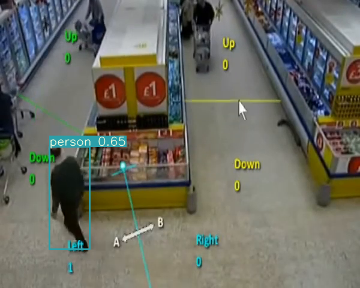
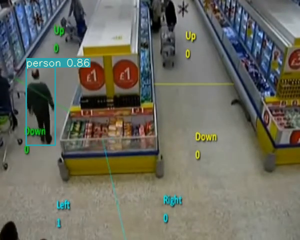
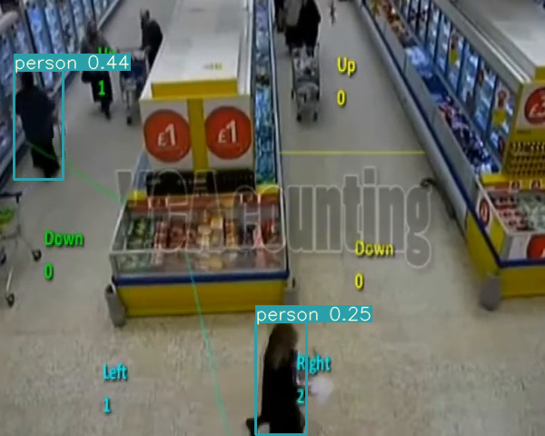

# Youtube Video
[Link to Video](https://youtu.be/LRHGJYNfA9o)

YoloV3 Simplified for training on Colab with custom dataset.

## Data Collection and PreProcessing 
In this case, I used the smalcoco dataset for training. smalcoco already has 'person' in one of their 80 classes. I'm also using a pretrained weights file to get good accuracy, however I'm training the model again for 300 epochs for finetuning purposes. </br>
Command I used for training: ``!python train.py --data data/smalcoco/smalcoco.data --batch 3 --cache --epochs 300 --nosave`` </br>
However I also have 109 images in data/customdata/Images folder in case if I couldn't get any prediction from using the pretrained model. </br>
For collecting the data I used the Market15001 dataset. </br>
One point to note is that I didn't actually use this data and hence didn't annotate it. But if needed, I would have trained the model on this separate data.

## Person Detecting and Tracking
In order to implement person tracking, I converted the test video into a sequence of images using ffmpeg. Specifically, I used the command: 
``ffmpeg -i input_video.mp4 -vf "fps=30" out_image_%04d.png``</br>
To run inference on these images, I used the command: ``!python detect.py --cfg cfg/yolov3-spp.cfg --source /content/drive/MyDrive/Framed_Images --output out_out --conf-thres 0.1 ``

The hierarchy of My customdata file is as follows:
```
data
  --customdata
    --train_images/
      --img001.png
      --img002.png
      --...
    custom.data #data file
    custom.names #contains the class name
    custom.txt #list of names of the train & test images that our model will be trained & tested on.
```

## Final Submission
<p float="left">
  
  
  
</p>